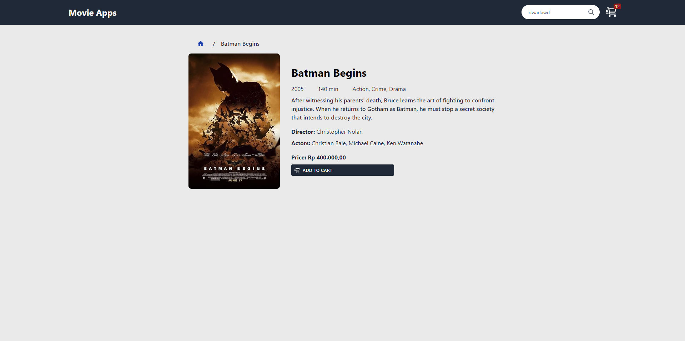
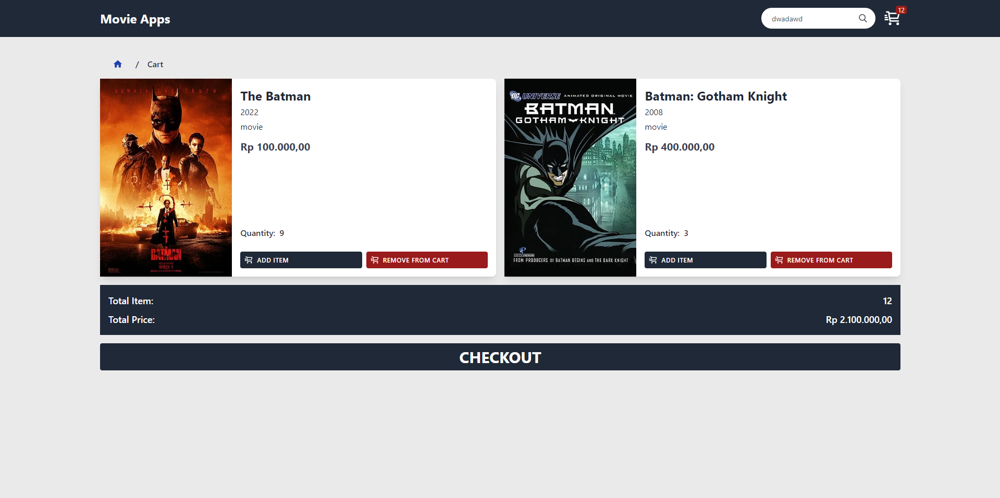
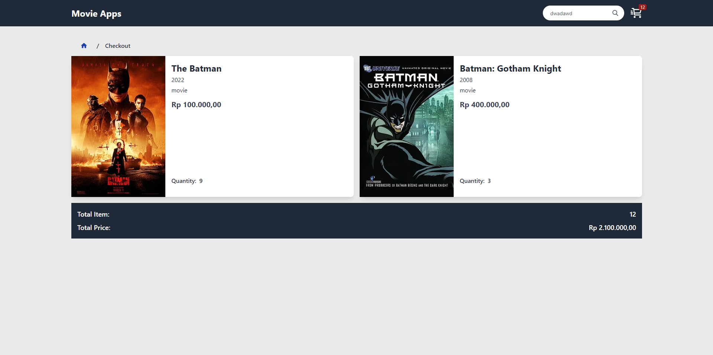

<h1 align="center">Movie Apps</h1>

<p align="center">This project is an application that displays movie list, search, movie detail, cart & checkout</p>

---

<br>

### Home, Detail, Detail, Cart, and Checkout Page

<h1 align="center">
  
  
  
  
</h1>

## 📱 Features

- Create layout using Tailwindcss
- Integrate Movie API from OMDB API
- Create hook to fetch data using React Query

## 🚀 Technologies & Resources

- [x] [React + Vite + TypeScript](https://vitejs.dev/)
- [x] [Redux](https://redux.js.org/introduction/getting-started)
- [x] [Tailwindcss](https://tailwindcss.com/docs/installation)
- [x] [React Query](https://tanstack.com/query/v3)
- [x] [React Router Dom](https://reactrouter.com/en/main/start/overview)
- [x] [OMDB API](https://www.omdbapi.com/)

## 💻 Installation

1. #### Clone the repository:

   ```bash
   git clone https://github.com/fadhildwia/movie-apps.git
   ```

2. #### Navigate to the project directory:

   ```bash
   cd movie-apps
   ```

3. #### Install the dependencies:
   ```bash
   yarn
   #or
   npm install
   ```
4. #### Make a copy of `.env.example` to `.env`:
   ```bash
   # Put your OMDB API credential in .env file
   cp .env.example .env
   ```
5. #### Run the project:
   ```bash
   yarn dev
   #or
   npm run dev
   ```

<!-- ## License

This example application is licensed under the [MIT License](LICENSE).

--- -->

---

Feel free to explore the code and adapt it to suit your needs! If you encounter any issues or have suggestions for improvements, please don't hesitate to open an issue or submit a pull request.
